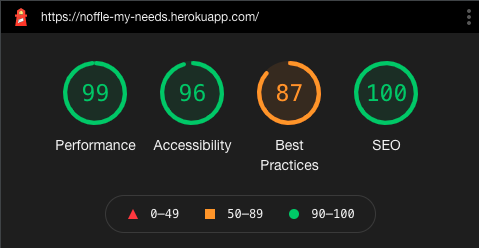
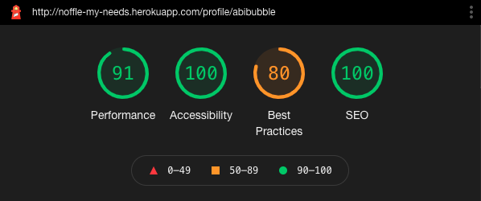

# Noffle My Needs


[Here is a link to the final project](https://noffle-my-needs.herokuapp.com/)

This project was built for the [Trust In SODA](https://www.trustinsoda.com/) and [Code Institute](https://codeinstitute.net/) Hackathon in September 2021, by the team A11y Allies. The theme is 'Building An Accessible Workplace', and we were tasked with creating a tool that helps employers create a truly accessible workspace, or improve their recruitment and onboarding experience for every person. It is designed to be responsive on a wide range of devices, whilst also being easy to navigate through, and fully accessible.


## Contents

* [Definition](#definition)

* [User Experience (UX)](#user-experience-(ux))
  * [Initial Discussion](#initial-discussion)
  * [User Stories](#user-stories)

* [Design](#design)
  * [Color Scheme](#color-scheme)
  * [Typography](#typography)
  * [Imagery](#imagery)
  * [Wireframes](#wireframes)
  * [User Journey](#user-journey)
  * [Features](#features)
  * [Audio](#audio)

* [Technologies Used](#technologies-used)
  * [Languages Used](#languages-used)
  * [Frameworks, Libraries & Programs Used](#frameworks-libraries-and-programs-used)

* [Deployment](#deployment)
  * [Initial Deployment](#initial-deployment)
  * [How to Fork it](#how-to-fork-it)
  * [How to Clone it](#how-to-clone-it)
  * [Making a Local Clone](#making-a-local-clone)

* [Testing](#testing)
  * [W3C Validator](#w3c-validator)
  * [Testing User Stories](#testing-user-stories)
  * [Full Testing](#full-testing)
  * [Further Testing](#further-testing)
  * [Solved Bugs](#solved-bugs)
  * [Known Bugs](#known-bugs)
  * [Lighthouse](#lighthouse)
    * [Performance](#performance)
    * [Accessibility](#accessibility)
    * [Best Practices](#best-practices)
    * [SEO](#seo)

* [Credits](#credits)
  * [Code](#code)
  * [Content](#content)
  * [Media](#media)
  * [Acknowledgements](#acknowledgements)

---

## Definition

**Noffle**  
_noun_  
A state of need of a particular person  
Usage: "I've set a 'Please Speak Up' Noffle on my work system so that everyone knows I may be hard of hearing."  
Similar: State, Need, Setting, Status

---

## User Experience (UX)

### Initial Discussion

* The theme for this Hackathon is 'Building An Accessible Workplace', and we were tasked with creating a tool that helps employers create a truly accessible workspace, or improve their recruitment and onboarding experience for every person.
* We chose to work on the former, ensuring that all employees can feel that their needs are met every day while they're at work.
* This site should be fully inclusive for all employees, not just those with visible disabilities, but also including those with mental health disabilities, as well as all neurotypical and able-bodied employees.

### User Stories

#### First Time Visitor Goals

As a first time visitor to this site, a user should be able to :

* Easily navigate the site.
* Intuitively and easily understand what to do.
* Register for an account.
* Set my noffles.
* Get visual feedback when an action on the site is completed.

#### Returning Visitor Goals

In addition to the First Time Visitor Goals, a Returning Visitor should be able to :

* Log in.
* Update their state.
* See the public states of other users.
* Be confident that their password is be stored securely.
* Navigate intuitively, with no need to use the browser's back button.

#### Admin Goals

In addition to the First Time and Returning Visitor Goals, as an administrator of this site, an admin user should be able to:

* Be confident that a user can't to brute force their way into the restricted pages.
* Edit or delete any user.
* Add a new state.
* Edit or delete any state.
* Give or remove admin rights.

[Back to Top](#title)

---

## Design

### Overall

* We wanted to make this a fun way to start your workday. So when you first log in, we wanted to ensure that the user was met with a welcome relating to the time of day.
* We also decided to call the individual need states 'Noffles' for the same reason. We can't say it without a little giggle, and we wanted it to brighten everyone's day, leading to a happier and more inclusive workspace overall.
* This led into the name of this project, 'Noffle My Needs'. It provides a small description of what this site is targeting - the needs of each employee in the business, whilst also giving them that little smile or giggle from the word 'Noffle'.

### Color Scheme

* WHAT COLORS USED AND WHY

### Typography

* WHAT FONT AND WHY

### Imagery

* WHAT IMAGES ARE USED AND WHY

### Wireframes

[Here are the wireframes for desktop, mobile and tablet for this project](static/docs/wireframes.pdf).

### User Journey


### Features

* Update a Noffle


* Create and Delete a profile.


* Create, Edit and Delete a Noffle for admin users only.


* Edit admin rights and delete a user for admin users only.


* Confirm to delete modal.


* Auto-updating copyright year.


### Future Features

* Email verification before a user can set their noffles.
* Enter user's password to delete user account.
* Dynamic desk movement to allow for different office layouts.

### Audio

* No audio is used on this site.

### Navigation bar

The navigation bar changes depending on user status and screen size:

| Nav Link | Logged Out | Logged In (User) | Logged In (Admin) |
|-------|-----|-----|-----|
| Logo (Office page if logged in, Landing Page if not) | &#9989; | &#9989; | &#9989; |
| Log In | &#9989; | &#10060; | &#10060; |
| Register | &#9989; | &#10060; | &#10060; |
| Set My Noffles | &#10060; | &#9989; | &#9989; |
| Office Page | &#10060; | &#9989; | &#9989; |
| Profile | &#10060; | &#9989; | &#9989; |
| Manage Noffles | &#10060; | &#10060; | &#9989; |
| Manage Users | &#10060; | &#10060; | &#9989; |
| Log Out | &#10060; | &#9989; | &#9989; |

* Logged in


* Logged out


* An admin


* On small screen sizes


[Back to Top](#title)

---

## Database Design

MongoDB was used to store data for this site in a database. The data has been set out in two collections, which are described below:

| Users |    |    |
|---|---|---|
| _id | ObjectId |    |
| username | string |    |
| password | string |    |
| first_name | string |    |
| last_name | string |    |
| image_no | int |    |
| pronouns| string |    |
| is_admin | boolean |    |
| noffles | array | noffles._id |

| Noffles |    |
|---|---|
| _id | ObjectId |
| name | string |
| description | string |
| permanent | boolean |
| private | boolean |
| icon | string |

[Back to Top](#title)

---

## Technologies Used

### Languages Used

* [HTML5](https://developer.mozilla.org/en-US/docs/Web/Guide/HTML/HTML5)
* [CSS3](https://developer.mozilla.org/en-US/docs/Archive/CSS3#:~:text=CSS3%20is%20the%20latest%20evolution,flexible%20box%20or%20grid%20layouts.)
* [JavaScript](https://developer.mozilla.org/en-US/docs/Web/JavaScript)
* [Python](https://www.python.org/)

### Workspace

#### GitPod

[GitPod](https://gitpod.io/) was used as a virtual IDE workspace to build this site.

### Version Control

#### Git

[Git](https://git-scm.com/) was used for version control by utilizing the Gitpod terminal to add and commit to Git and push to GitHub.

#### GitHub

[GitHub](https://github.com/) is used to store the code for this project after being pushed from Git.

### Wireframing

#### Balsamiq

[Balsamiq](https://balsamiq.com/) was used to create the wireframes during the design process.

### Responsive Design

#### Am I Responsive Design

[Am I Responsive Design](http://ami.responsivedesign.is/#) was used to check the responsive design of the site, and to create the final site image.

#### Responsinator

[Responsinator](http://www.responsinator.com/) was used to help improve the responsive design on a variety of devices.

### Documentation

#### Shields.io

[Shields.io](https://shields.io/) was used to create the GitHub badges for the top of this README.md file.

### Site Design

#### Font Awesome

[Font Awesome](https://fontawesome.com/) was used on all pages to add the icons.

#### Google Fonts

[Google Fonts](https://fonts.google.com/) was used to select all the fonts on the site.

#### Favicon.io

[favicon.io](https://favicon.io/) used to create a site favicon.

### Database Design Technologies

#### MongoDB

[MongoDB](https://www.mongodb.com/) was used to store the contents of the database, and allow full CRUD functionality.

#### Flask-PyMongo

[Flask-PyMongo](https://flask-pymongo.readthedocs.io/en/latest/) was used to connect this Python / Flask app to MongoDB.

### Frameworks, Libraries and Others

#### Heroku

[Heroku](https://www.heroku.com) was used to deploy the live site.

#### Google DevTools

[Google DevTools](https://developer.chrome.com/docs/devtools/) was used to help find what code correlated to which feature.

#### Lighthouse

[Lighthouse](https://developers.google.com/web/tools/lighthouse) was used to ensure that the code was as performant as possible, confirming to best practices, and SEO and Accessibility guidelines.

#### Flask

[Flask](https://flask.palletsprojects.com/en/2.0.x/) was used to help create the templating for this site.

#### Bootstrap

[Bootstrap](https://getbootstrap.com/) was used to create a beautiful, responsive website.

#### jQuery

[jQuery](https://jquery.com/) was used to make the DOM traversal easier within the JavaScript.

#### Jinja

[Jinja](https://jinja.palletsprojects.com/en/3.0.x/) was used to auto-populate the site with the contents of the database.

#### RandomKeygen

[RandomKeygen](https://randomkeygen.com/) was used to generate a strong `SECRET_KEY`.

#### Flask-paginate

[Flask-paginate](https://pythonhosted.org/Flask-paginate/) was used to add pagination to the homepage.

#### pip

[pip](https://pip.pypa.io/en/stable/) was used to install the required dependancies for this site.

#### dnspython

[dnspython](https://pypi.org/project/dnspython/) was used to provide access to DNS.

[Back to Top](#title)

---

## Deployment

### Requirements for Deployment

* Python
* MongoDB account and database
* GitHub account
* Heroku account

### Initial Deployment

MONGO_DBNAME - This is the name of the database you need to connect to in MongoDB.

MONGO_URI - This can be found on the MongoDB website by following these steps:
    * In the clusters tab of your database, click connect on the associated cluster.
    * Click 'Connect', then 'Connect your application'.
    * Copy the string, then substitute the password (from Database access NOT your MongoDB password) and change "myFirstDatabase" to your MONGO_DBNAME.

SECRET_KEY - This is a custom string set up to keep sessions secure. We recommend using a 'Fork Knox' level password generated by [RandomKeygen](https://randomkeygen.com/).

This site was deployed to Heroku by following these steps:

1. Heroku needs to be told what the requirements are for this project, so go into your GitPod terminal, and create files to explain the requirements by using the following commands:
    * `pip3 freeze --local > requirements.txt`
    * `echo web: python run.py > Procfile` - Ensure there is no blank line after the contents of this file
2. Push these changes to your repository.
3. Ensure you have a .gitignore file in your repository, and if not, create one.
4. Add `env.py` and `__pycache__/` into your .gitignore file, and save the file. This is to avoid any sensitive information being added into your repository.
5. Create an env.py file, and add the following information to it, updating the '## x ##' values with your own values:

    ``` python
    import os

    os.environ.setdefault("IP", "0.0.0.0")
    os.environ.setdefault("PORT", "5000")
    os.environ.setdefault("SECRET_KEY", " ## YOUR SECRET_KEY ## ")
    os.environ.setdefault("MONGO_URI", " ## YOUR MONGO_URI ## ")
    os.environ.setdefault("MONGO_DB", " ## YOUR MONGO_DBNAME ## ")
    ```

6. Login or sign up to [Heroku](https://www.heroku.com).
7. Select 'Create New App' in the top right of your dashboard.
8. Choose a unique app name, and select the region closest to you, before clicking 'Create App'.
9. Go to the 'Deploy' tab, find 'Deployment Method' and select 'GitHub'.
10. Search to find your GitHub repository, and click 'Connect'. Don't enable automatic deployment yet, as this can cause errors.
11. Go to the 'Settings' tab, find 'Config Vars', and click 'Reveal Config Vars'.
12. Enter key value pairs that match those in your env.py file, displayed like this :

    | Key | Value |
    |---|---|
    | IP | 0.0.0.0 |
    | PORT | 5000 |
    | MONGO_DBNAME | ## YOUR DATABASE NAME ## |
    | MONGO_URI | ## YOUR MONGO_URI ## |
    | SECRET_KEY | ## YOUR SECRET_KEY ## |

13. Go to the 'Deploy' tab, and click 'Enable Automatic Deployment'.
14. In 'Manual Deploy', choose which branch you'd like to deploy from (I chose 'master' branch, this is also known as 'main').
15. Click 'Deploy Branch' to deploy your app onto the Heroku servers.
16. Once the app has finished building, click 'Open App' to open your site.

### How to Fork it

1. Login or Sign Up to [GitHub](www.github.com).
2. On GitHub, go to [Abibubble/noffle-my-needs](https://github.com/Abibubble/noffle-my-needs).
3. In the top right, click "Fork".
4. You will need to create an env.py file with your own values, and create a MongoDB database with the data keys and types as shown above.
5. You will also need to install all of the project requirements. This can be done using the command `pip3 install -r requirements.txt`.
6. Type `python3 app.py` in your GitPod terminal to run your local site of this project.

### Making a Local Clone

1. Log in to [GitHub](https://www.github.com) and locate the [Repository](https://github.com/Abibubble/noffle-my-needs) for this site.
2. Under the repository name, above the list of files, click "Code".
3. Here you can either Clone or Download the repository.
4. You should clone the repository using HTTPS, clicking on the icon to copy the link.
5. Open Git Bash.
6. Change the current working directory to the new location, where you want the cloned directory to be.
7. Type `git clone`, and then paste the URL that was copied in Step 4.
8. Press Enter, and your local clone will be created.
9. You will need to create an env.py file with your own values, and create a MongoDB database with the data keys and types as shown above.
10. You will also need to install all of the project requirements. This can be done using the command `pip3 install -r requirements.txt`.
11. Type `python3 app.py` in your GitPod terminal to run your local site of this project.

For a more detailed version of these steps, go to the [Github Docs](https://docs.github.com/en/github/creating-cloning-and-archiving-repositories/cloning-a-repository#cloning-a-repository-to-github-desktop) page on this topic.

[Back to Top](#title)

---

## Testing

### W3C Validator

The W3C Markup Validator, W3C CSS Validator and JSHint were used to validate the project to ensure there were no syntax errors within the site.

1. W3C Markup Validator
    * [HTML Results](LINK)

2. W3C CSS Validator
    * [CSS Results](LINK)

3. markdownlint GitPod Extension
    * [markdownlint Extension](https://open-vsx.org/vscode/item?itemName=DavidAnson.vscode-markdownlint)

4. JSHint GitPod Extension
    * [JSHint Extension](https://open-vsx.org/vscode/item?itemName=dbaeumer.jshint)

5. PEP8 Online
    * [PEP8 Online](http://pep8online.com/)

    

[Back to Top](#title)

### Testing User Stories

#### First Time Visitor

##### Easily navigate the site

* How

##### Intuitively and easily understand what to do

* How

##### Register for an account

* How

##### Set my Noffles

* How

##### Get visual feedback when an action on the site is completed

* How

#### Returning Visitor

##### Log in

* How

##### Update their Noffles

* How

##### See the public Noffles of other users

* How

##### Be confident that their password is be stored securely

* How

##### Navigate intuitively, with no need to use the browser's back button

* How

#### Admin

##### Be confident that a user can't to brute force their way into the restricted pages

* How

##### Edit or delete any user

* How

##### Add a new Noffle

* How

##### Edit or delete any Noffle

* How

##### Give or remove admin rights

* How

[Back to Top](#title)

### Full Testing

#### Desktop / Laptop

1. Google Chrome
    * All tested and working correctly.

2. Microsoft Edge
    * All tested and working correctly.

3. Mozilla Firefox
    * All tested and working correctly.

4. Safari
    * All tested and working correctly.

#### Tablet

1. Safari
    * All tested and working correctly.

#### Mobile

1. Google Chrome
    * All tested and working correctly.

2. Safari
    * All tested and working correctly.

3. Samsung Internet
    * All tested and working correctly.

### Further Testing

* The website was tested on Google Chrome, Firefox, Microsoft Edge, Safari and Samsung Internet browsers.
* Testing was not done on Internet Explorer due to it being depreciated in favour of Microsoft Edge.
* The website was viewed on a variety of devices, including:
  * Custom built desktop PC, running Windows 10
  * Acer Aspire V Nitro Laptop, running Windows 10
  * Lenovo B51 IntelCore i7 Laptop, running Ubuntu 16.04 LTS
  * MacBook Pro (15-inch, 2017), running macOS Catalina
  * MacBookAir7,2 (13-inch, 2017)
  * iPad 6,11 5th generation, running iOS 10.3
  * Amazon Fire tablet 7
  * iPhone 7
  * iPhone X
  * iPhone 12
  * OPPO Find X2
  * OPPO Find X2 Lite
  * Samsung Galaxy A70
  * Samsung Galaxy S9
  * Samsung Galaxy S10+
  * Samsung A20
  * xBox One

A large amount of testing was done to ensure that all pages were visible or hidden correctly, all buttons worked as they should, and the site worked as it should.
Friends, family members, and other developers were asked to review the site and documentation to point out any bugs and/or user experience issues that they came across.

[Back to Top](#title)

### Solved Bugs

1. WHAT THE BUG IS
    * WHAT STEPS WE TOOK TO FIX IT

### Known Bugs

* ANY BUGS LEFT IN THE CODE AFTER FINAL DEPLOYMENT, FOR FIXING IN FUTURE RELEASES

### Lighthouse Testing

We tested this website using DevTools Lighthouse feature, and got these results:

#### Desktop Lighthouse



#### Mobile Lighthouse



#### Performance

* EXPLAIN SCORE AND HOW WE IMPROVED IT IF NECESSARY

#### Accessibility

* EXPLAIN SCORE AND HOW WE IMPROVED IT IF NECESSARY

#### Best Practices

* EXPLAIN SCORE AND HOW WE IMPROVED IT IF NECESSARY

#### SEO

* EXPLAIN SCORE AND HOW WE IMPROVED IT IF NECESSARY

[Back to Top](#title)

---

## Credits

### Code

* [Font Awesome](https://fontawesome.com/): Library of icons used for social media and download links.
* [Autoprefixer CSS online](https://autoprefixer.github.io/): To aid in the CSS prefixing.
* [Boostrap](https://getbootstrap.com/): Throughout the site, to create a beautiful responsive site, without taking too much time.
* ANY CODE WE USED FROM OTHER PEOPLE OR SITES AND WHO IT'S FROM, INCLUDING CREDITING ANYONE WHO HELPED ME FIX BUGS

### Audio Credit

* WHO OWNS THE AUDIO AND WHO EDITED THE AUDIO

### Content

* WHO OWNS THE CONTENT OF THE SITE

### Media

* WHO OWNS ANY MEDIA ON THE SITE, SUCH AS IMAGES AND VIDEOS

### Acknowledgements

* The team at [Code Institute](https://codeinstitute.net/), for teaching me the necessary skills to create this site.
* The Hackathon team A11y Allies, who created this page. This team consists of :
  * [Abi Harrison](https://github.com/Abibubble)
  * [Andrew Dempsey](https://github.com/andrewdempsey2018)
  * [Carla Buongiorno](https://github.com/CarlaBuongiorno)
  * [Henrique Peroni](https://github.com/Henriqueperoni)
  * [Monika Hrda](https://github.com/monika-hrda)
* Our team facilitator [Megan Armstrong](https://www.linkedin.com/in/megan-armstrong4/).

[Back to Top](#title)
